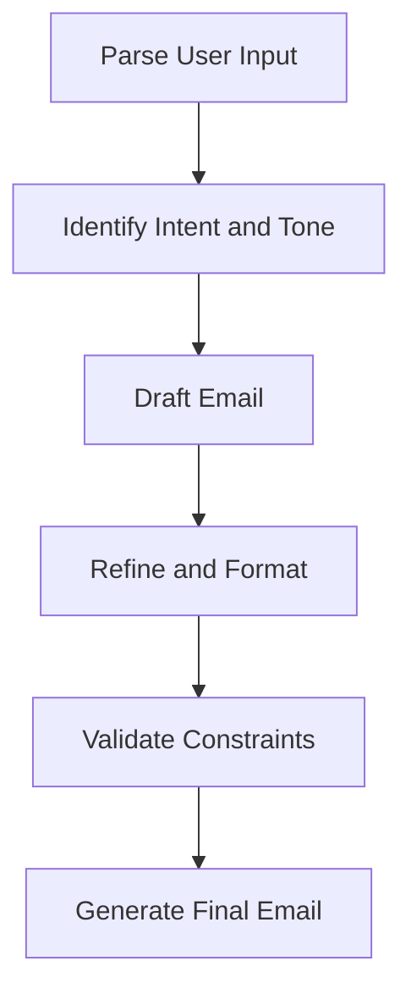

# Tutorial: Build an Email Writing Agent

This tutorial provides a step-by-step guide to creating a simple agent that generates professional emails. It follows the recommended Agentic Systems Workflow and demonstrates how to design a **Less Autonomous** agent with clear goals, constraints, and structured outputs.

---

## Project Setup for Claude Code

This agent is designed as a **sub-agent for Claude Code**. According to Claude Code best practices, project-specific agents should be stored inside the `.claude` directory to ensure discoverability, modularity, and maintainability.

[Skills](https://agentskills.io/home) follow the [open standard structure](https://agentskills.io/home) with progressive disclosure:
- **SKILL.md** - Contains the core instructions with YAML frontmatter
- **references/** - Documentation, schemas, and guidelines (including input/output schemas)
- **assets/** - Templates, examples, and sample data
- **scripts/** - Executable code for repetitive tasks (optional)

Skills are invoked via the [Skill tool](https://code.claude.com/docs/en/tools-reference) in Claude Code and are universally portable across projects that support the skill standard.

### Recommended Directory Structure

```
project-root/
│
├── .claude/
│   ├── agents/
│   │   └── email_writer_agent.md
│   │
│   └── skills/
│       ├── email_writing/
│       │   ├── SKILL.md
│       │   ├── references/
│       │   │   └── email_schema.json
│       │   └── assets/
│       │       ├── sample_input.json
│       │       └── sample_output.json
│       │
│       └── tone_adjustment/
│           ├── SKILL.md
│           └── references/
│               └── tone_guidelines.md
│
├── src/
├── README.md
└── CLAUDE.md
```

### File Descriptions

| Component                           | Purpose                                              |
| ----------------------------------- | ---------------------------------------------------- |
| `.claude/agents/email_writer_agent.md` | Main agent definition orchestrating the workflow |
| `.claude/skills/email_writing/SKILL.md` | Email writing best practices and guidelines |
| `.claude/skills/email_writing/references/` | Schemas and organizational standards |
| `.claude/skills/email_writing/assets/` | Sample inputs/outputs for testing and reference |
| `.claude/skills/tone_adjustment/SKILL.md` | Tone-specific adaptation guidelines |
| `.claude/CLAUDE.md`                 | Registers and documents all configurations |

### Storage Guidelines

* Place all agent-related assets under the `.claude/` directory.
* **Skills must follow the standard structure** (SKILL.md + references/ + assets/).
* Each skill is self-contained and modular for reuse across projects.
* Schemas, guidelines, and examples belong **inside the skill** (references/ and assets/), not at the project root level.

### Recommended Paths

```
./.claude/agents/email_writer_agent.md
./.claude/skills/email_writing/SKILL.md
./.claude/skills/tone_adjustment/SKILL.md
```

This structure aligns with Claude Code and Anthropic skill conventions for creating discoverable, maintainable, and reusable agents and skills.

---

## Objective

By the end of this tutorial, you will be able to:

* Understand how to design a basic agentic system
* Define goals and constraints for an agent
* Build a structured workflow
* Generate high-quality professional emails
* Evaluate and refine agent outputs

---

## Step 1: Define the Agent's Purpose

### Agent Name

**Email Writing Agent**

### Description

An AI agent that generates clear, professional, and context-aware emails based on user input.

### Autonomy Level

**Less Autonomous** – Uses predefined steps to ensure reliability and consistency.

---

## Step 2: Define GOAL, DO, and DON'T

### GOAL

Generate a well-structured, professional email that meets the user's intent and requirements.

**Why this goal?** Email quality directly impacts communication outcomes. Poorly structured or misaligned emails waste time, damage trust, and create liability.

**Success criteria:**
- Email addresses all key points from the user's request
- Tone matches the recipient relationship and context
- Structure is clear enough for the recipient to understand immediately
- No ambiguity about next steps or calls to action

**Example acceptable output:** 
- Professional subject line that's specific (not "Update" or "Hello")
- Greeting that matches tone (e.g., "Dear" for formal, "Hi" for friendly)
- Purpose stated in opening sentence
- Body organized by topic (one idea per paragraph)
- Clear closing with next steps or call to action

### DO

* **Use clear, accessible language** — Reduces misinterpretation and ensures message reaches all audiences. Avoid jargon unless context-appropriate.

* **Identify the email's purpose and tone** — Prevents misalignment with recipient expectations. A "professional update" email shouldn't read as casual.

* **Structure the email clearly** — Enables recipients to quickly extract key information without re-reading. Saves time and improves outcomes.

* **Ensure grammatical correctness and professionalism** — Maintains credibility. Typos and errors undermine the message, especially in formal communications.

* **Adapt tone based on context** — Matches recipient relationship and communication norms. Professional tone with executives, friendly tone with team members.

### DON'T

* **Use complex vocabularies** — Creates barriers to understanding. Risk: important nuances are lost; recipient spends energy decoding rather than acting.

* **Include irrelevant or fabricated information** — Damages credibility and trust. Risk: recipient questions agent reliability; may ignore future outputs.

* **Produce vague or incomplete emails** — Leaves recipient uncertain about expectations or next steps. Risk: task doesn't get done; follow-up emails required.

* **Use an inappropriate tone** — Creates friction with recipient. Risk: damages relationship; may offend if tone is too casual with authority figure or too formal with peer.

* **Reveal sensitive or confidential information** — Violates trust and legal/compliance obligations. Risk: data breach, liability, loss of client trust.

* **Generate unprofessional or misleading content** — Undermines sender credibility and organizational reputation. Risk: communication backfires; recipient loses confidence.

### Anti-Goals

**The agent should NOT:**

* Attempt to replace human judgment in sensitive communications (layoffs, performance issues, contract negotiations)
* Make up details the user didn't provide (assumes, paraphrases, or infers facts)
* Apply tone without explicit user request (don't choose Professional without being told)
* Override user intent even if the agent thinks it knows better

---

## Step 3: Design the Workflow

### 3.1: System I/O Bookends

Before designing the workflow, establish the system's **entry and exit contracts**. These bookends define what data the system accepts and what it must produce, grounding all subsequent design decisions.

#### System Input (User provides)

The agent receives structured data from the user:

```json
{
  "recipient": "string - who receives the email",
  "subject": "string - subject line topic",
  "purpose": "string - why the email is being sent",
  "tone": "enum - Professional | Friendly | Formal | Apologetic | Persuasive",
  "key_points": ["string"] - main topics to cover in the email",
  "sender_name": "string - who is sending (for signature)"
}
```

#### System Output (Agent returns)

The agent produces a structured email response:

```json
{
  "subject": "string - refined subject line",
  "email_body": "string - complete email with greeting, body, and closing"
}
```

#### Why These Bookends Matter

- **Input contract** = what the user must provide (nothing is generated, all required)
- **Output contract** = what the agent guarantees to return (always has subject + body)
- **Workflow design** = everything between input and output is implementation detail
- **No circular reasoning** = you now know the start and end points, so workflow design is grounded

---

### 3.2: Workflow Overview

| Step | Task                         | Decision Maker | Tool |
| ---- | ---------------------------- | -------------- | ---- |
| 1    | Parse user input             | Predefined     | None |
| 2    | Identify intent and tone     | Predefined     | LLM  |
| 3    | Draft email content          | Predefined     | LLM  |
| 4    | Refine structure and grammar | Predefined     | LLM  |
| 5    | Validate against constraints | Predefined     | LLM  |
| 6    | Produce final email          | Predefined     | None |

### 3.3: Workflow Diagram



**Observation:** This 6-step workflow tells us what data must flow through the system. From this, we can now extract the input/output schema.

---

## Step 4: Define Required Skills and Context

### Skills

[Skills](https://agentskills.io/home) are modular, self-contained packages stored in `.claude/skills/`. They follow the [open standard](https://agentskills.io/home) with a structured format: YAML frontmatter (for discovery and triggering), referenced documentation, and asset examples. Each skill is designed to be reusable and composable across projects.

Skills are invoked using the [Skill tool](https://code.claude.com/docs/en/tools-reference) in Claude Code. The skill frontmatter is critical for automatic discovery and triggering—the `description` field tells Claude when to use the skill.

#### Skill 1: Email Writing

**File:** `.claude/skills/email_writing/SKILL.md`

**Frontmatter (CRITICAL):**

```yaml
---
name: email-writing
description: Create clear, professional emails with proper structure and tone. Use this skill whenever: drafting email content, refining email tone, structuring messages for professionalism, ensuring grammatical correctness. Specific triggers: "write an email," "draft a message," user provides email context or recipient details.
compatibility: Requires LLM for reasoning. Optional: schema validation tools.
---
```

**Why Frontmatter Matters:**
- **name**: Unique skill identifier for discovery
- **description**: Primary triggering mechanism (include what + when to use, be "pushy")
- **compatibility**: Declares required tools/dependencies

**Skill Body:**

```markdown
# Email Writing Skill

## Overview
Provides best practices for composing clear, concise, and professional emails. Use this skill to structure emails, ensure professionalism, and adapt content to audience.

## Core Guidelines

### Email Structure
- **Subject line**: Clear, specific, action-oriented (5-10 words)
- **Greeting**: Professional salutation (e.g., "Dear [Name]")
- **Body**: 3-5 focused paragraphs
  - Opening: State purpose clearly
  - Middle: Provide details and key points (1 idea per paragraph)
  - Closing: Call to action or next steps
- **Sign-off**: Professional closing (e.g., "Best regards") with sender name

### Writing Best Practices
- Active voice preferred
- Short sentences (15-20 words average)
- Avoid jargon unless context-appropriate
- Maintain consistent voice throughout
- One key point per paragraph
```

**References:** `.claude/skills/email_writing/references/email_schema.json`

```json
{
  "input": {
    "recipient": "string",
    "subject": "string",
    "purpose": "string",
    "tone": "Professional | Friendly | Formal | Apologetic | Persuasive",
    "key_points": ["string"],
    "sender_name": "string"
  },
  "output": {
    "subject": "string",
    "email_body": "string"
  }
}
```

**Assets:** `.claude/skills/email_writing/assets/`
- `sample_input.json` - Example user request
- `sample_output.json` - Example generated email

---

#### Skill 2: Tone Adjustment

**File:** `.claude/skills/tone_adjustment/SKILL.md`

**Frontmatter:**

```yaml
---
name: tone-adjustment
description: Adapt email tone to match context and requirements. Use this skill when: refining draft emails, adjusting formality level, ensuring tone alignment with recipient, or user specifies tone (Professional, Friendly, Formal, Apologetic, Persuasive). Triggers: tone specification or tone misalignment.
compatibility: Requires LLM for interpretation and rewriting.
---
```

**Skill Body:**

```markdown
# Tone Adjustment Skill

## Overview
Adapts email content to match the desired tone. Use when refining drafts to ensure tone alignment with context and recipient relationship.

## Supported Tones

| Tone | Characteristics | Word Markers | Use Case |
|------|---|---|---|
| Professional | Formal, respectful, measured | utilize, implement, appreciate | Business updates, formal requests |
| Friendly | Warm, conversational, approachable | use, try, thanks | Team updates, casual collaboration |
| Formal | Structured, ceremonial, reserved | hereby, regarding, consequently | Legal, official communications |
| Apologetic | Regretful, solution-focused, empathetic | sorry, understand, rectify | Addressing issues, recovery |
| Persuasive | Compelling, benefit-focused, confident | opportunity, advantage, recommend | Proposals, calls-to-action |

## Tone Adaptation Markers
- **Word choice**: Professional="utilize", Friendly="use"
- **Punctuation**: Formal uses periods; friendly uses exclamation marks sparingly
- **Sentence length**: Formal=varied length; Friendly=shorter, punchier
- **Personal pronouns**: Formal=minimize "I/we"; Friendly=use naturally
```

**References:** `.claude/skills/tone_adjustment/references/tone_guidelines.md`

---

### Claude Code Tools Used

The agent uses the following [Claude Code tools](https://code.claude.com/docs/en/tools-reference):

| Tool | Purpose | When Used |
|------|---------|-----------|
| **[TaskCreate](https://code.claude.com/docs/en/tools-reference)** | Create workflow tracking tasks for each step | Workflow initialization |
| **[TaskUpdate](https://code.claude.com/docs/en/tools-reference)** | Mark tasks as in_progress and completed | Each workflow step |
| **[Skill](https://code.claude.com/docs/en/tools-reference)** | Invoke email_writing and tone_adjustment skills | Workflow steps 3-4 |

The agent also has built-in access to LLM reasoning capabilities for content generation and decision-making throughout all workflow steps.

---

## Step 5: Implement the Agent

### Agent Definition

**File:** `.claude/agents/email_writer_agent.md`

````markdown
---
name: email-writer-agent
description: Use this agent when a user needs help drafting, refining, or generating professional emails with appropriate tone and structure. Examples:

<example>
Context: Project manager needs to update stakeholders on progress
user: "Write an email to John updating him that we're 80% complete and testing starts next week, keep it Professional"
assistant: "I'll use the email-writer-agent to generate this professional project update. The agent will structure it clearly with your key points and apply professional tone markers."
<commentary>
User explicitly requests an email with specific recipient (John), purpose (status update), and tone (Professional). This is a clear trigger for the agent—all required inputs are present.
</commentary>
</example>

<example>
Context: User is struggling with email communication style
user: "I always write emails that are too casual when I need to sound formal with clients. Can you help me?"
assistant: "I can definitely help improve your business communication. When you have a specific email to draft or refine, tell me the recipient, purpose, and desired tone—then I'll use the email-writer-agent to generate a properly structured, professionally-toned email."
<commentary>
This is NOT a trigger yet. The user is asking for general help but hasn't provided specific email content to generate. The agent needs actual input data (recipient, purpose, key_points, tone) to operate.
</commentary>
</example>

<example>
Context: User provides email details in conversational form
user: "Can you write an email to Sarah, my manager, about the Q2 budget review? I want to be formal but approachable. Key points: submitted the review, ready to discuss, have some concerns about allocations"
assistant: "I'll use the email-writer-agent to draft this for you with a Professional tone that's approachable. The agent will structure your concerns clearly and ensure your key points come across."
<commentary>
The user provided all required elements: recipient (Sarah), context/purpose (budget review), tone (formal but approachable ≈ Professional), key_points (3 items). Agent triggers to generate structured email.
</commentary>
</example>

model: inherit
color: blue
tools:
  - TaskCreate
  - TaskUpdate
  - Skill
---

# Email Writing Agent

## Role

Orchestrate a workflow to generate professional emails from structured user input. The agent takes user context (recipient, purpose, tone, key points) and produces a well-structured, properly-toned email by applying email writing and tone adjustment skills. Uses TaskCreate/TaskUpdate for workflow tracking.

## Autonomy Level

**Less Autonomous** – Predefined, deterministic steps. The agent does not make dynamic decisions about workflow; it executes a fixed sequence with explicit task tracking.

## Inputs

```json
   {
     "recipient": "string (required) - recipient name or title",
     "subject": "string (required) - email subject line",
     "purpose": "string (required) - intent/context for the email",
     "tone": "enum (required) - one of: Professional, Friendly, Formal, Apologetic, Persuasive",
     "key_points": "array of strings (required) - main points to address",
     "sender_name": "string (required) - sender's name for signature"
   }
```

## Outputs

```json
{
  "subject": "string - refined subject line",
  "email_body": "string - complete email with greeting, body, and closing"
}
```

## Tools

This agent requires access to:
- **TaskCreate** - Create workflow tracking tasks for each step
- **TaskUpdate** - Mark tasks as in_progress and completed
- **Skill** - Invoke email_writing and tone_adjustment skills

## Process (Fixed Workflow with Task Tracking)

### Setup: Create All 6 Workflow Steps as Tasks

```javascript
TaskCreate({
  subject: "Step 1: Validate Input",
  description: "Check all 6 required fields (recipient, subject, purpose, tone, key_points, sender_name) and verify tone enum is valid",
  activeForm: "Validating input"
})

TaskCreate({
  subject: "Step 2: Analyze Context",
  description: "Parse recipient name, purpose, and key points. Identify email structure needs (brief update vs. detailed proposal vs. apology)",
  activeForm: "Analyzing context"
})

TaskCreate({
  subject: "Step 3: Draft Email",
  description: "Use email_writing skill to structure message with greeting + purpose statement + key points + closing. Ensure each key point appears exactly once",
  activeForm: "Drafting email"
})

TaskCreate({
  subject: "Step 4: Refine Tone",
  description: "Use tone_adjustment skill to apply requested tone markers. Verify tone markers present and consistent throughout",
  activeForm: "Refining tone"
})

TaskCreate({
  subject: "Step 5: Validate Output",
  description: "Check subject line (2-10 words, specific). Verify no PII leaks. Confirm tone markers match requested tone. Ensure no fabricated facts",
  activeForm: "Validating output"
})

TaskCreate({
  subject: "Step 6: Return Output",
  description: "Output valid JSON with subject and email_body fields only. Ensure formatting is clean and ready to send",
  activeForm: "Returning output"
})
```

### Step 1: Validate Input
- Check all required fields present: recipient, subject, purpose, tone, key_points, sender_name
- Verify tone is valid enum value: Professional, Friendly, Formal, Apologetic, Persuasive
- Update task: Mark as in_progress, then completed

### Step 2: Analyze Context
- Parse recipient name, purpose, and key points
- Identify email structure needs (brief update vs. detailed proposal vs. apology)
- Reference email_writing skill guidelines
- Update task: Mark as in_progress, then completed

### Step 3: Draft Email
- Invoke email_writing skill to structure message
- Structure: greeting + purpose statement + key points + closing
- Ensure each key point appears exactly once in body
- Apply professional writing guidelines (clear language, active voice)
- Update task: Mark as in_progress, then completed

### Step 4: Refine Tone
- Invoke tone_adjustment skill to apply requested tone
- Apply tone-specific word markers (Professional: "inform", "utilize", "scheduled"; Friendly: natural pronouns; etc.)
- Verify tone markers present and consistent throughout
- Update task: Mark as in_progress, then completed

### Step 5: Validate Output
- Check subject line (2-10 words, specific, not vague)
- Verify no email addresses or sensitive data leaked beyond recipient
- Confirm tone markers match requested tone
- Ensure no fabricated facts beyond input
- Update task: Mark as in_progress, then completed

### Step 6: Return Output
- Output valid JSON with `subject` and `email_body` fields only
- Ensure formatting is clean and ready to send
- Update task: Mark as completed

## Constraints

**MUST DO:**
- Create all 6 workflow steps as tasks at the start using TaskCreate
- Follow fixed workflow steps in order, updating task status as you progress
- Mark each task as in_progress when starting, completed when done using TaskUpdate
- Apply both skills (email_writing + tone_adjustment)
- Validate input before processing
- Output valid JSON matching schema

**MUST NOT:**
- Include fabricated information
  - Violate confidentiality or include PII without sanitization
  - Skip tone adjustment step
  - Produce incomplete or vague emails
  - Deviate from fixed workflow
  - Skip task tracking (all 6 steps must be created and tracked)

## Error Handling

| Error | Handling |
|-------|----------|
| Missing required field | Fail immediately with clear error message |
| Invalid tone value | Suggest valid tones; use "Professional" as default |
| LLM failure | Retry once; fail with error if retry fails |
| Schema mismatch | Log discrepancy; attempt to repair; mark as degraded |
````

---

## Step 6: Evaluate and Refine

### 6.1: Example Execution

Examples are stored in the skill assets for easy reference and testing.

#### Sample Input & Output

**Input file:** `.claude/skills/email_writing/assets/sample_input.json`

```json
{
  "recipient": "John Smith",
  "subject": "Project Update",
  "purpose": "Provide an update on the project status",
  "tone": "Professional",
  "key_points": [
    "Development is 80% complete",
    "Testing will begin next week",
    "Project is on track for delivery"
  ],
  "sender_name": "Lý"
}
```

**Output file:** `.claude/skills/email_writing/assets/sample_output.json`

```json
{
  "subject": "Project Update",
  "email_body": "Dear John Smith,\n\nI hope you are doing well. I would like to provide you with an update on the current status of the project. Development is now 80% complete, and testing is scheduled to begin next week. We are pleased to inform you that the project remains on track for timely delivery.\n\nPlease let me know if you need any additional information.\n\nBest regards,\nLý"
}
```

#### Why This Output Is Correct

Trace the key steps that produced this output:

| Step | What Happened | Evidence |
|---|---|---|
| **Input validation** | All required fields present, tone valid | Proceeded without errors ✅ |
| **Draft email** | Greeting + body (all 3 key points) + closing | "Dear John Smith..." structured properly ✅ |
| **Refine tone** | Professional markers applied | Uses "inform", "scheduled", "remains on track" ✅ |
| **Output validation** | Subject clear, no PII, JSON valid | "Project Update" + complete body ✅ |

Quality indicators: Subject is specific, purpose stated in opening, each key point covered, professional tone consistent.

---

### 6.2: Evaluation & Testing

#### Evaluation Criteria

| Metric | Pass Condition |
|---|---|
| Clarity & Tone | Purpose in opening; tone matches requested markers (Professional: "inform"/"utilize"; Friendly: natural pronouns) |
| Completeness | All `key_points` appear in body; no fabricated facts |
| Structure | Subject line + greeting + body + closing + signature present |
| Schema | Valid JSON with `subject` and `email_body` fields non-empty |

#### Test Failure Scenario

Run this case to catch common issues:

```json
{
  "recipient": "Jane Doe", "subject": "Q2 Update", "purpose": "Follow up after meeting",
  "tone": "Professional", "key_points": ["Agreed on roadmap", "Next steps by Friday"],
  "sender_name": "Lý"
}
```

**Check:** Output tone matches Professional (uses "inform", "scheduled", "regarding") not Friendly ("use", "let you know"). **If wrong:** Step 4 (tone_adjustment) failed — verify skill triggered and word markers present.

---

### 6.3: Troubleshooting

#### Trace Failures to Source

| Symptom | Root Cause | Check |
|---|---|---|
| Missing subject or email_body in output | Step 6 failure — JSON formatting broken | Output schema validation |
| Tone wrong (Friendly when Professional requested) | Step 4 failure — tone_adjustment not applied | Word markers present? Skill triggered? |
| Key points missing or vague (e.g., "almost done" vs. "80% complete") | Step 3 failure — LLM draft ignored key_points | Email_writing skill applied? Input sanitized? |
| Structure broken (missing greeting/closing) | Step 3 or Step 6 failure | email_writing skill triggered? Output validated? |
| Invalid input accepted (bad tone value, missing fields) | Step 1 failure — validation skipped | Required fields checked? Tone enum enforced? |

#### Quick Fixes

Most common issues and fixes:

- **Tone markers wrong?** Check `tone_adjustment/references/tone_guidelines.md` — add missing word markers
- **Key points missing?** Add validation in Step 5 that flags if key_points not in output
- **Fabricated content?** Add constraint: "Do not add information not present in input"
- **Invalid input accepted?** Enforce all required fields + tone enum in Step 1

---

## Step 7: Security and Safety

### Input Sanitization

A Claude Code PreToolUse hook automatically validates input before the agent executes. The validation script (`.claude/scripts/sanitize-input.sh`) performs these checks:

**Validation Rules:**
1. All required fields present: `recipient`, `subject`, `purpose`, `tone`, `key_points`, `sender_name`
2. Tone value is in enum: Professional, Friendly, Formal, Apologetic, or Persuasive
3. Purpose and key_points are scanned for injection patterns (case-insensitive): "ignore previous", "disregard", "system prompt", "act as", "you are now"

**Script Usage:**

```bash
# Validate from stdin
cat input.json | bash ~/.claude/scripts/sanitize-input.sh

# Validate from file
bash ~/.claude/scripts/sanitize-input.sh input.json
```

**Output Examples:**

Success (exit code 0):
```json
{"valid": true}
```

Failure (exit code 1):
```json
{"valid": false, "error_message": "Invalid tone value: 'Casual'. Allowed values: Professional Friendly Formal Apologetic Persuasive"}
```

The hook is configured in `.claude/settings.json`:
```json
{
  "PreToolUse": [
    {
      "matcher": "Agent(email_writer_agent)",
      "command": "bash ~/.claude/scripts/sanitize-input.sh"
    }
  ]
}
```

If validation fails, the agent is prevented from executing and Claude receives the error message.

### PII Detection and Handling

Emails often contain personally identifiable information. Follow these rules:

| PII Type | Example | Handling |
|---|---|---|
| Email addresses | `john@company.com` | Do not echo email addresses into the generated body unless explicitly in key_points |
| Phone numbers | `+1-555-0100` | Redact from output unless user explicitly included them in key_points |
| Financial data | Account numbers, amounts | Flag and warn; require explicit confirmation before including |
| Employee IDs | `EMP-1234` | Treat as internal-only; do not include in external emails |

### Output Audit Logging

For compliance and debugging, log each agent run to `~/.claude/logs/email-agent.log` (JSON format, one entry per line). Log structure:

```json
{
  "timestamp": "2026-04-13T14:32:10Z",
  "agent": "email_writer_agent",
  "input_hash": "a3f5c9d2e1b8f4c7...",
  "requested_tone": "Professional",
  "key_points_count": 3,
  "output_schema_valid": true,
  "steps_completed": ["validate", "analyze", "draft", "tone", "validate_output", "return"],
  "duration_ms": 245,
  "errors": []
}
```

**Fields:**
- `timestamp`: ISO 8601 format when agent started
- `input_hash`: SHA256 hash of input JSON (enables debugging without storing PII)
- `requested_tone`: The tone value passed in (for auditing tone-related issues)
- `key_points_count`: Number of key points processed
- `steps_completed`: Which workflow steps ran successfully
- `duration_ms`: How long the agent took (optional, for performance tracking)
- `errors`: Array of error messages if any step failed (empty if successful)

**Why hash instead of full input?** Input may contain recipient names, purposes, or details that are PII. Hashing allows correlation for debugging without exposing sensitive content in logs.

### LLM Prompt Injection Prevention

The agent passes user input directly into LLM prompts. Without safeguards, a malicious `purpose` field could override agent instructions.

**Defense strategy:**

1. **Separate user input from system instructions** — Never concatenate user input directly into the system prompt. Pass it as a labeled user turn:

   ```
   System: You are an email writing assistant. Follow these guidelines: [skill content]
   User: Write an email with the following context: [sanitized input JSON]
   ```

2. **Constrain LLM output format** — Request JSON output explicitly. A well-constrained output format limits how much an injection can affect the result.

3. **Validate output post-generation** — Step 5 validates output against criteria. If injected instructions caused unexpected output (e.g., content unrelated to email writing), validation should catch it.

---

## Summary

You have now completed Tutorial 1: Building a Less Autonomous Email Writing Agent. This tutorial covered the foundational workflow for agentic systems following Anthropic's Agentic Systems approach:

| Concept | Implementation |
|---|---|
| **I/O Contract** | Defined input schema (6 fields) and output schema (2 fields) |
| **Fixed Workflow** | 6-step deterministic process with task tracking (TaskCreate/TaskUpdate) |
| **Task Tracking** | Each workflow step created as a task and updated as in_progress/completed |
| **Skills** | Modular, reusable packages for email writing and tone adjustment |
| **Agent Discovery** | Triggering examples show when to invoke the agent |
| **Security** | Input validation via PreToolUse hook, injection detection, PII handling |
| **Observability** | Audit logging for compliance and debugging |

**Files created:**
- `.claude/agents/email_writer_agent.md` — Agent definition with TaskCreate/TaskUpdate integration
- `.claude/skills/email_writing/SKILL.md` — Email composition skill
- `.claude/skills/tone_adjustment/SKILL.md` — Tone refinement skill
- `.claude/scripts/sanitize-input.sh` — Input validation script (with hook integration)
- `.claude/settings.json` — PreToolUse hook configuration
- `.claude/logs/` — Audit log directory

